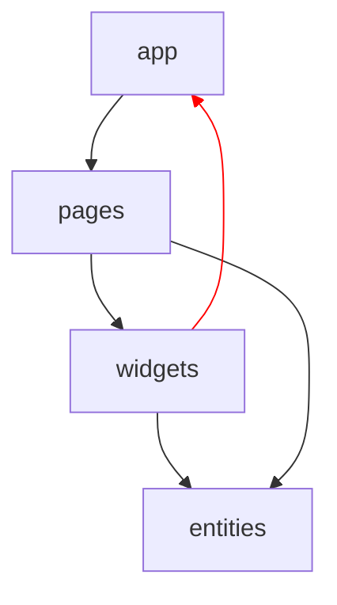
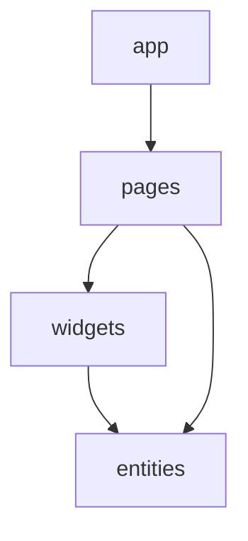
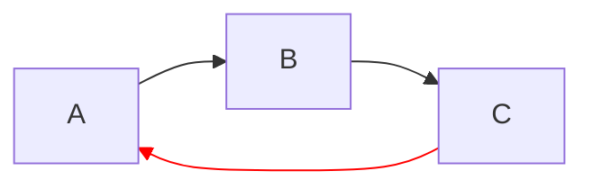
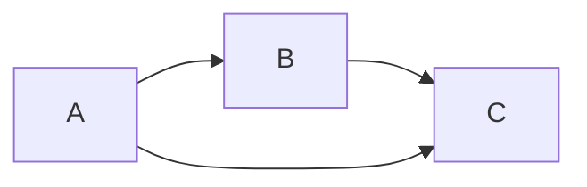
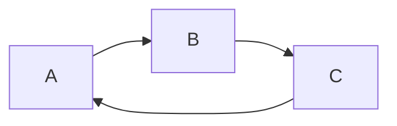

# Однонаправленность зависимостей

Большинство архитектур организуют код в слои. Конкретный набор слоёв может отличаться: разные
архитектуры используют разные границы и по-разному распределяют между ними ответственность.

Общим для таких архитектур является не состав слоёв, а направление зависимостей: зависимость между
слоями всегда движется в одном направлении.

Если один слой зависит от другого, обратная зависимость не допускается. Таким образом, слои образуют
упорядоченную структуру, в которой код может зависеть только от того, что находится ниже по
направлению зависимостей.

Это ограничение распространяется не только на прямые импорты. Зависимость возникает везде, где один
слой должен знать о реализации, типах или API другого слоя.

## Какую проблему решает

Без единого направления зависимости слои начинают зависеть друг от друга произвольным образом. В
результате появляется циклическая зависимость между частями системы:

<div align="center">



</div>

Такую систему становится сложнее изменять: изменение одного слоя может потребовать изменений почти
во всём проекте, а границы между слоями перестают иметь практический смысл.

Одно направление зависимостей превращает набор слоёв в ациклическую структуру:

<div align="center">



</div>

Изменения могут распространяться только в направлении существующих зависимостей, а нижележащий слой
не обязан знать о коде, который его использует.

## Правила

1. **Зависимость только в разрешённом направлении**

    Каждый слой может зависеть только от слоёв, находящихся ниже по направлению зависимостей.

    Конкретное направление и состав слоёв определяются архитектурой проекта, но для каждой пары
    слоёв оно должно быть однозначным.

2. **Запрет обратных зависимостей**

    Если слой `A` зависит от слоя `B`, слой `B` не может зависеть от `A`.

    Это относится как к прямому импорту, так и к косвенной зависимости через другие модули. В
    противном случае одно направление превращается в цикл:

<div align="center">



</div>

3. **Горизонтальные связи — тоже зависимости**

    Импорт между двумя модулями одного слоя — это не «нейтральная» связь, а такая же зависимость,
    как импорт между слоями. То, что модули находятся на одном уровне, не делает их независимыми:
    `A` зависит от `B`, если использует его API, типы или реализацию.

    Поэтому горизонтальные связи нужно учитывать в том же графе зависимостей и разрешать явно. Если
    модули одного слоя могут импортировать друг друга без ограничений, в нём так же легко возникает
    цикл: `A` зависит от `B`, а `B` — от `A`. В такой системе вертикальное направление между слоями
    формально соблюдается, но сам слой уже не имеет однозначной структуры.

    Обычно это означает одно из трёх решений: вынести общий код в отдельный модуль, поднять его в
    слой, от которого смогут зависеть оба модуля, или явно задать допустимое направление между
    модулями одного слоя. Запрет горизонтальных связей — не самоцель; важно, чтобы каждая из них
    была осознанной и не создавала цикл.

## Почему

Одно направление зависимостей даёт конкретные практические выгоды:

- **Простая ментальная модель**

    Для любого компонента понятно, от каких компонентов он может зависеть. Не возникает произвольных
    циклов и взаимных зависимостей.

- **Локальность изменений**

    Область, которую задевает правка, ограничена слоями выше по направлению: то, что лежит ниже, о
    ней не знает и меняться не обязано. Без единого направления такой границы нет — изменение может
    потребоваться где угодно.

    > Например, UI-компонент можно полностью заменить на другой, продолжая использовать тот же
    > компонент бизнес-логики. Бизнес-логика при этом не знает, какой UI её вызывает, поэтому её не
    > нужно изменять или повторно тестировать из-за изменений в интерфейсе.

- **Упрощение тестирования**

    Зависимости можно последовательно подменять стабами или моками, не сталкиваясь с взаимными
    ссылками.

- **Возможность независимого развития частей системы**

    Нижние уровни не должны знать о деталях верхних, поэтому изменение сценариев использования или
    UI не требует изменений в базовых компонентах.

## Правильно

**Зависимости движутся в одном направлении:**

<div align="center">



</div>

```ts
// A
import { something } from 'B';
import { anotherThing } from 'C';

// B
import { anotherThing } from 'C';
```

`C` при этом ничего не знает о `B` или `A`.

## Неправильно

**Обратная зависимость:**

```ts
// A
import { something } from 'B';

// B
import { anotherThing } from 'A'; // ❌
```

**Циклическая зависимость через несколько слоёв:**

<div align="center">



</div>

```ts
// A
import { value } from 'B';

// B
import { value } from 'C';

// C
import { value } from 'A'; // ❌
```

## Рекомендации

1. **Проверяйте зависимости как граф**

    Направление зависимостей полезно рассматривать не как набор отдельных правил для импортов, а как
    свойство всего графа зависимостей. Для каждой зависимости должно быть понятно, почему она
    движется в разрешённом направлении.

2. **Не нарушайте направление ради удобства**

    Если коду одного слоя понадобилась функциональность вышележащего слоя, не следует добавлять
    обратный импорт только потому, что это самый короткий путь.

    Такая потребность обычно означает, что ответственность расположена не на своём уровне или что
    необходима дополнительная абстракция, через которую зависимость можно развернуть.

3. **Сохраняйте направление при рефакторинге**

    Перемещение кода между слоями может изменить направление существующих зависимостей. После
    рефакторинга необходимо проверить не только работоспособность кода, но и сохранение
    архитектурного направления.
