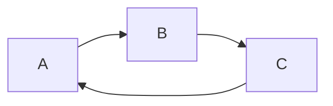
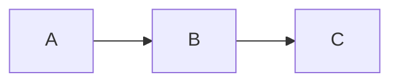

# Однонаправленность зависимостей

Большинство архитектур организуют код в слои. Конкретный набор слоёв может отличаться: разные
архитектуры используют разные границы и по-разному распределяют между ними ответственность.

Общим для таких архитектур является не состав слоёв, а направление зависимостей: зависимость между
слоями всегда движется в одном направлении.

Если один слой зависит от другого, обратная зависимость не допускается. Таким образом, слои образуют
упорядоченную структуру, в которой код может зависеть только от того, что находится ниже по
направлению зависимостей.

Это ограничение распространяется не только на прямые импорты. Зависимость возникает везде, где один
слой должен знать о реализации, типах или API другого слоя.

## Какую проблему решает

Без единого направления зависимости слои начинают зависеть друг от друга произвольным образом. В
результате появляется циклическая зависимость между частями системы:



Такую систему становится сложнее изменять: изменение одного слоя может потребовать изменений в
нескольких других, а границы между ними перестают иметь практический смысл.

Одно направление зависимостей превращает набор слоёв в ациклическую структуру:



Изменения могут распространяться только в направлении существующих зависимостей, а нижележащий слой
не обязан знать о коде, который его использует.

## Правила

Чтобы направление зависимостей оставалось однозначным, необходимо соблюдать два правила:

1. **Зависимость только в разрешённом направлении**

    Каждый слой может зависеть только от слоёв, находящихся ниже по направлению зависимостей.

    Конкретное направление и состав слоёв определяются архитектурой проекта, но для каждой пары
    слоёв оно должно быть однозначным.

2. **Запрет обратных зависимостей**

    Если слой `A` зависит от слоя `B`, слой `B` не может зависеть от `A`.

    Это относится как к прямому импорту, так и к косвенной зависимости через другие модули. В
    противном случае одно направление превращается в цикл:

    ```mermaid
    flowchart LR
        A --> B --> C --> A
    ```

## Почему

Одно направление зависимостей даёт конкретные практические выгоды:

- **Предсказуемость изменений**

    Зная, от каких слоёв зависит код, можно определить направление распространения изменений.
    Изменение нижележащего слоя потенциально затрагивает его потребителей, но сам он не зависит от
    них.

- **Отсутствие циклов между слоями**

    Если зависимости всегда движутся в одном направлении, циклическая зависимость между слоями
    невозможна. Это упрощает структуру проекта и делает граф зависимостей ацикличным.

- **Независимость нижележащих частей**

    Слой не должен знать о коде, который находится выше него. Поэтому его можно изменять или
    переиспользовать, не втягивая в него зависимости от потребителей.

- **Понятные границы ответственности**

    Направление зависимости показывает не только то, кто кого использует, но и кто от кого зависит.
    Это делает архитектурные границы проверяемыми по импортам.

- **Упрощение рефакторинга**

    При перемещении кода между слоями достаточно сохранить допустимое направление зависимостей.
    Обратные связи не требуют поддерживать скрытые связи с потребителями.

## Правильно

**Зависимости движутся в одном направлении:**


```ts
// A
import { something } from 'B';

// B
import { anotherThing } from 'C';
```

`C` при этом ничего не знает о `B` или `A`.

## Неправильно

**Обратная зависимость:**

```ts
// A
import { something } from 'B';

// B
import { anotherThing } from 'A'; // ❌
```

**Циклическая зависимость через несколько слоёв:**


```ts
// A
import { value } from 'B';

// B
import { value } from 'C';

// C
import { value } from 'A'; // ❌
```

## Рекомендации

1. **Проверяйте зависимости как граф**

    Направление зависимостей полезно рассматривать не как набор отдельных правил для импортов, а как
    свойство всего графа зависимостей. Для каждой зависимости должно быть понятно, почему она
    движется в разрешённом направлении.

2. **Не нарушайте направление ради удобства**

    Если коду одного слоя понадобилась функциональность вышележащего слоя, не следует добавлять
    обратный импорт только потому, что это самый короткий путь.

    Такая потребность обычно означает, что ответственность расположена не на своём уровне или что
    необходима дополнительная абстракция, через которую зависимость можно развернуть.

3. **Сохраняйте направление при рефакторинге**

    Перемещение кода между слоями может изменить направление существующих зависимостей. После
    рефакторинга необходимо проверить не только работоспособность кода, но и сохранение
    архитектурного направления.
