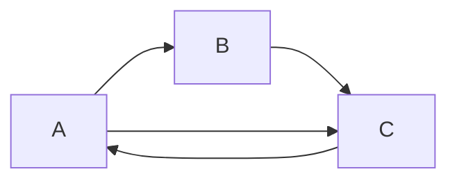

# Слои задает проект

Состав слоёв — это часть архитектуры конкретного проекта. Универсального списка слоёв, подходящего
для любого проекта, не существует.

Каждый проект самостоятельно определяет, какие слои ему нужны, где проходят их границы и какую
ответственность несёт каждый из них.

Поэтому одинаковые по назначению части системы могут находиться в разных слоях в разных проектах.
Например, то, что в одном проекте выделено в отдельный слой, в другом может быть частью
существующего слоя.

## Какую проблему решает

Попытка использовать заранее заданный набор слоёв заставляет проект подстраиваться под чужую
архитектуру вместо того, чтобы отражать собственные требования.

Это приводит к искусственным границам: появляются слои без самостоятельной ответственности,
функциональность приходится перемещать между ними только ради соответствия шаблону, а исключения
начинают восприниматься как ошибки.

Слои должны описывать структуру конкретной системы, а не соответствие универсальной классификации.

## Правила

Чтобы слои оставались частью осознанной архитектуры, необходимо соблюдать два правила:

1. **Состав слоёв определяет проект**

    Проект сам определяет список слоёв, их количество и границы. Названия и состав слоёв из других
    архитектур не являются обязательными.

    Новый слой следует вводить тогда, когда он выражает самостоятельную архитектурную границу, а не
    только потому, что такая граница существует в другом проекте.

2. **Допустимые зависимости определяет проект**

    Проект сам определяет, какие зависимости между его слоями являются допустимыми.

    Если конкретная зависимость нарушает общепринятое направление зависимостей, это не делает её
    автоматически ошибкой. Она может быть необходимой особенностью архитектуры конкретного проекта.

    Важно, чтобы такая зависимость была осознанным решением, а не случайным результатом реализации.

## Почему

Самостоятельное определение слоёв даёт конкретные практические выгоды:

- **Соответствие архитектуре проекта**

    Слои отражают реальные границы системы и её ответственность, а не абстрактный архитектурный
    шаблон.

- **Отсутствие искусственных границ**

    Не требуется выделять отдельный слой только потому, что он предусмотрен некоторой методологией.
    Граница появляется тогда, когда она имеет значение для конкретного проекта.

- **Осознанные исключения**

    Архитектура может содержать зависимости, необходимые именно этому проекту. Они не маскируются
    под нарушение универсального правила, а рассматриваются как часть его архитектурного решения.

- **Эволюция архитектуры**

    По мере изменения проекта состав слоёв может изменяться вместе с ним. Добавление, объединение
    или разделение слоёв является нормальным архитектурным изменением.

## Правильно

**Разные проекты могут иметь разные слои:**

```text
Project A
├── domain
├── application
└── infrastructure
```

```text
Project B
├── features
├── shared
└── platform
```

Оба проекта самостоятельно определяют свои архитектурные границы. Названия `domain`, `application`,
`infrastructure`, `features`, `shared` и `platform` не являются обязательным набором.

**Осознанная особенность проекта:**



Если архитектура проекта требует зависимости `C → A`, она может быть допустимой частью этой
архитектуры. Сам факт того, что такая зависимость не соответствует общему принципу
однонаправленности, не является достаточным основанием считать её ошибкой.

## Неправильно

**Слой существует только ради соответствия шаблону:**

```text
src/
├── domain/
├── application/
├── infrastructure/
└── presentation/
```

При этом проект не имеет самостоятельной ответственности, которую требовал бы слой `application`, а
его код искусственно отделён от соседних частей только потому, что такой слой присутствует в
выбранной архитектуре.

**Зависимость запрещена только потому, что она «неправильная по правилам»:**

```ts
// C
import { something } from '../A';
```

Если эта зависимость является необходимой и явно предусмотрена архитектурой проекта, её наличие само
по себе не доказывает ошибку. Оценивать её необходимо относительно правил и целей конкретного
проекта.

## Рекомендации

1. **Сначала определяйте границу, затем слой**

    Не следует начинать проектирование с готового списка названий. Сначала определите
    самостоятельные архитектурные границы системы, а затем дайте им имена.

2. **Документируйте особенности проекта**

    Если проект использует нестандартный состав слоёв или допускает исключение из привычных правил
    зависимостей, это должно быть понятно из архитектуры и её документации.

3. **Не путайте принцип с конкретной реализацией**

    Архитектурный принцип может быть общим, а его реализация — различаться от проекта к проекту.
    Нельзя считать конкретный набор слоёв обязательной реализацией такого принципа.
