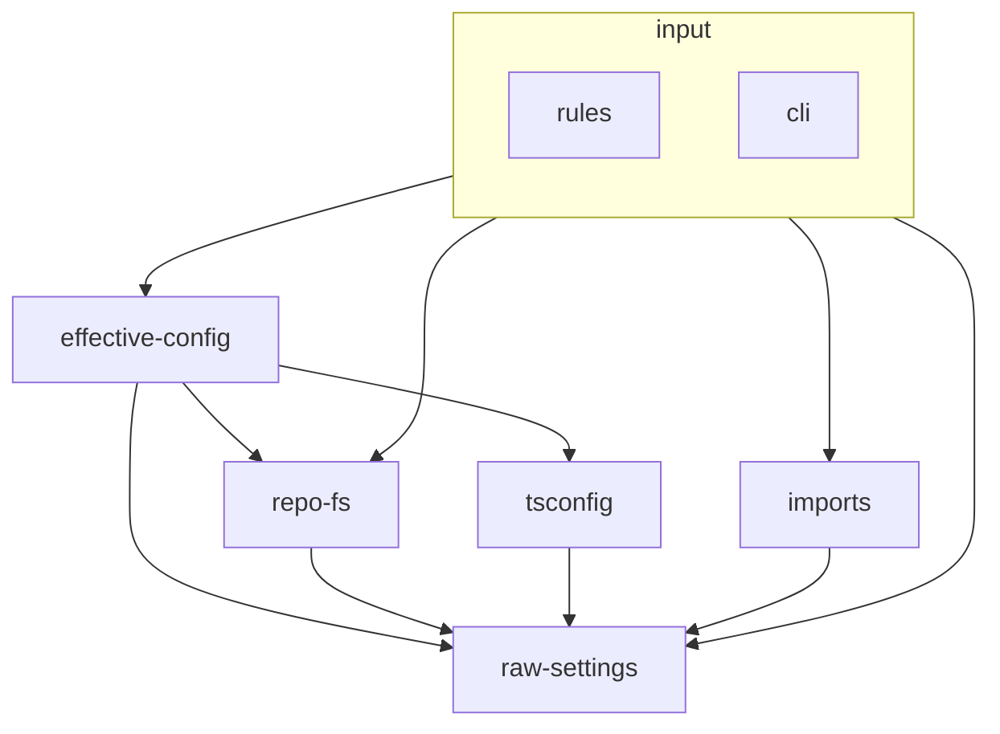

# Зависимости модулей

```mermaid
flowchart TD
    subgraph input
        direction TB

        rules

        cli
    end

    tsconfig
    imports
    effectiveConfig["effective-config"]
    rawSettings["raw-settings"]
    repoFs["repo-fs"]

    input --> effectiveConfig
    input --> rawSettings
    input --> imports
    input --> repoFs

    effectiveConfig --> rawSettings
    effectiveConfig --> tsconfig
    effectiveConfig --> repoFs

    repoFs --> rawSettings

    tsconfig --> rawSettings

    imports --> rawSettings
```
