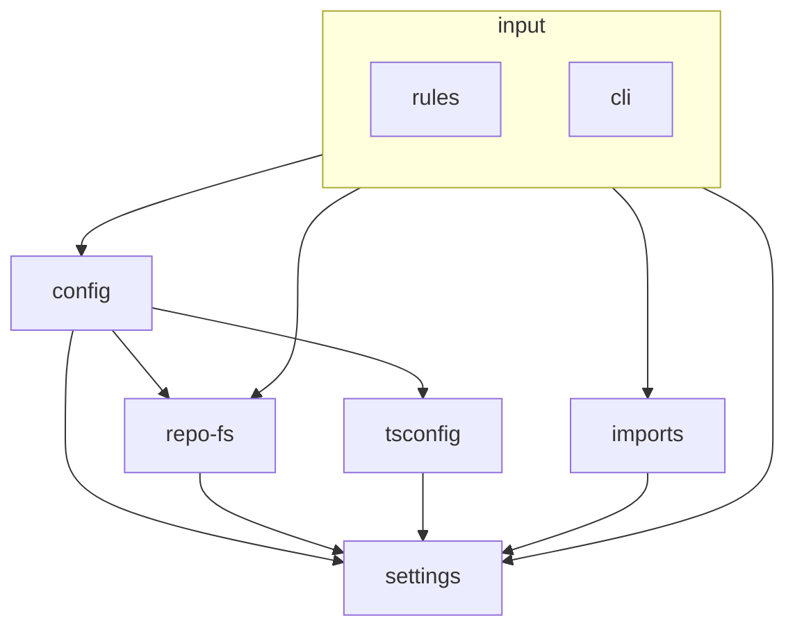

# Зависимости модулей

```mermaid
flowchart TD
    subgraph input
        direction TB

        rules

        cli
    end

    tsconfig
    imports
    config
    settings
    repoFs["repo-fs"]

    input --> config
    input --> settings
    input --> imports
    input --> repoFs

    config --> settings
    config --> tsconfig
    config --> repoFs

    repoFs --> settings

    tsconfig --> settings

    imports --> settings
```
