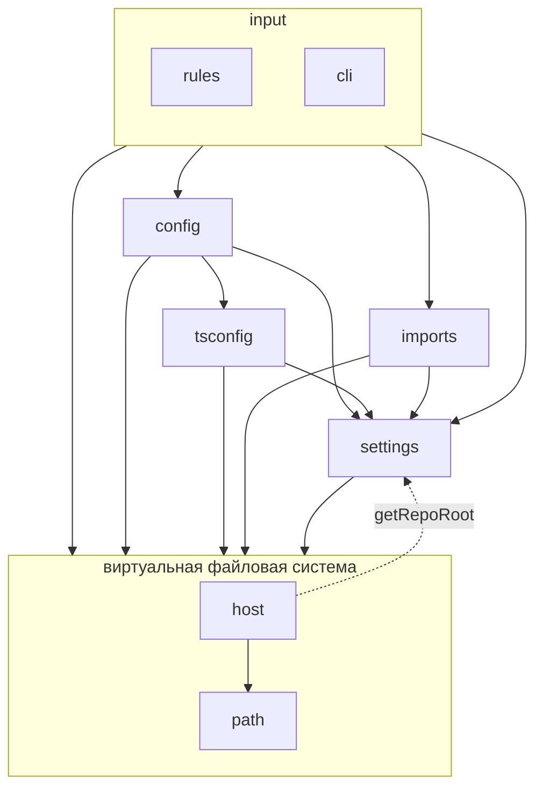

# Зависимости модулей

```mermaid
flowchart TD
    subgraph input
        direction TB

        rules

        cli
    end

    subgraph vfs["виртуальная файловая система"]
        host
        path
    end

    tsconfig
    imports
    config
    settings

    input --> config
    input --> settings
    input --> imports
    input --> vfs

    config --> settings
    config --> tsconfig
    config --> vfs

    host -. getRepoRoot .-> settings
    host --> path

    tsconfig --> settings
    tsconfig --> vfs

    imports --> settings
    imports --> vfs

    settings --> vfs
```
