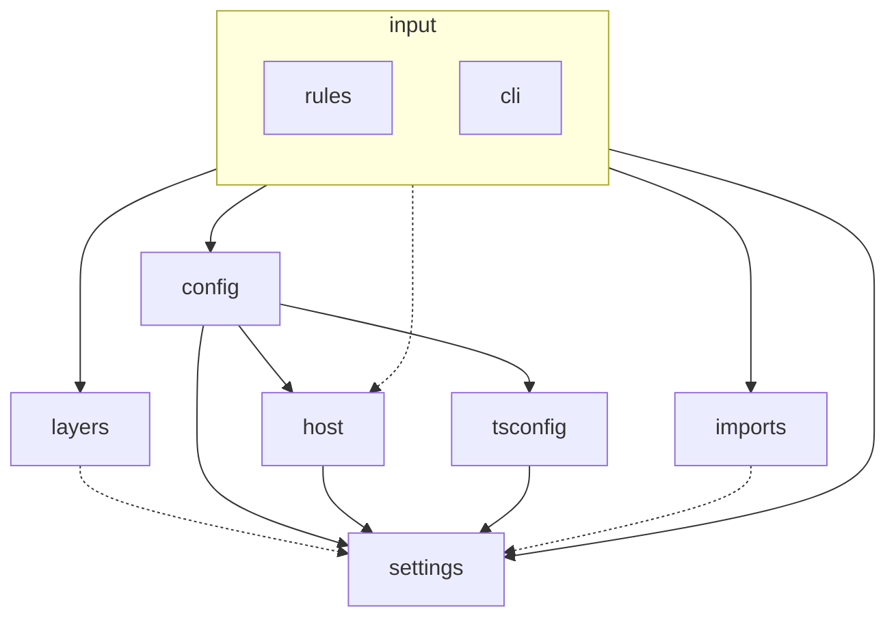

# Зависимости модулей

```mermaid
flowchart TD
    subgraph input
        direction TB

        rules

        cli
    end

    tsconfig
    imports
    config
    layers
    settings

    input --> config
    input --> settings
    input --> imports
    input --> layers
    input -.-> host

    layers -.-> settings

    config --> settings
    config --> tsconfig
    config --> host

    host --> settings

    tsconfig --> settings

    imports -.-> settings
```

> Пунктир — из зависимости берутся только типы или константы.
